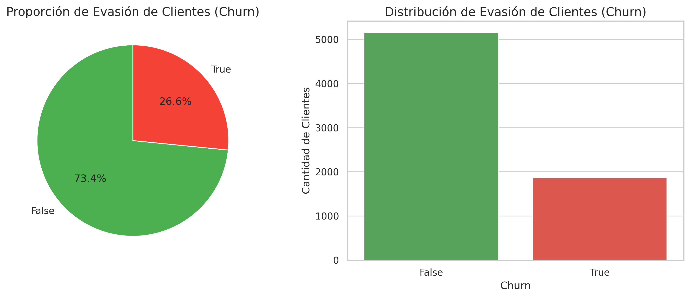
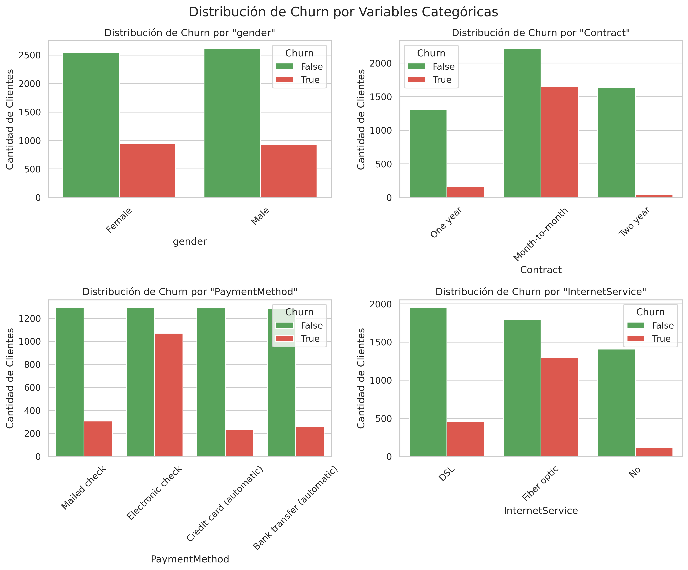

# Informe Final – Análisis de Evasión (Churn) · Telecom X

## 1. Introducción
La empresa enfrenta una alta tasa de cancelaciones y necesita comprender los factores que llevan a la pérdida de clientes.
El objetivo de este análisis es **comprender los factores asociados a la evasión de clientes (Churn)** en Telecom X y **proponer acciones** que contribuyan a reducirla.

**Tamaño de la muestra:** 7,032 clientes  
**Tasa de clientes perdidos (global):** 26.6% | **Retención:** 73.4%

---

## 2. Limpieza y Tratamiento de Datos
- Unificación de fuentes anidadas (`customer`, `phone`, `internet`, `account`) en `data_unificado`.
- Estandarización de tipos:
  - `Churn` a booleano; servicios adicionales y banderas a booleano.
  - Conversión de cargos: `Charges_Monthly` y `Charges_Total` a `float64`.
- Creación de métrica **Cuentas_Diarias** = `Charges_Monthly / 30` para granularidad diaria.
- Depuración de nombres problemáticos: renombre de `Charges.Monthly`→`Charges_Monthly` y `Charges.Total`→`Charges_Total`.
- Validaciones: ausencia de `NaN` críticos en cargos y coherencia de `tenure`.

---

## 3. Análisis Exploratorio de Datos (EDA)

### 3.1 Distribución de candelados
- Proporción de clientes: **cacelados = 26.6%** vs **continua = 73.4%**.
gráficos pastel y barras de `Churn`:

### 3.2 Resumen numérico de clientes
- **Tenure (meses):** media 32.42 | mediana 29 | rango [1, 72]
- **Cargos mensuales:** media 64.80 | mediana 70.35
- **Cargos totales:** media 2283.30 | mediana 1397.47
- **Cuentas diarias (≈ mensual/30):** media 2.16

### 3.3 evacion por variables categóricas
**Contrato (Contract) – Top evacion:**
- **Month-to-month** → 42.7%
- **One year** → 11.3%
- **Two year** → 2.8%

**Método de pago (PaymentMethod) – Top evacion:**
- **Electronic check** → 45.3%
- **Mailed check** → 19.2%
- **Bank transfer (automatic)** → 16.7%

**Tipo de Internet (InternetService) – Top evacion:**
- **Fiber optic** → 41.9%
- **DSL** → 19.0%
- **No** → 7.4%

**Género (gender) – Diferencias:**
- **Female** → 27.0%
- **Male** → 26.2%

### 3.4 Churn y variables numéricas
- **tenure:** típicamente, clientes con menor antigüedad muestran mayor cancelacion (confirmar en boxplots).
- **Charges_Monthly:** revisar si tarifas más altas se asocian a mayor cancelacion (boxplot/histograma por `Churn`).
- **Charges_Total:** valores bajos suelen reflejar clientes recientes con mayor probabilidad de fuga.

---

## 4. Conclusiones e Insights
1. **Tasa de cancelaciones relevantes:** 26.6% indica una pérdida importante de clientes.
2. **Contrato mes a mes** concentra mayor cancelacion (flexibilidad alta → salida fácil).
3. **Electronic check** (si aparece en top) muestra **tendencia a mayor cancelaciones** frente a métodos automáticos (transferencia/crédito).
4. **Internet de fibra/DSL**: evaluar si una tecnología específica concentra más cancelacion (p. ej., por expectativas de calidad/soporte).
5. **Tenure bajo** se asocia a mayor cancelacion: primeros meses críticos para retener.
6. **Cargos**: si los clientes con cargos mensuales más altos muestran más cancelaciones, revisar percepción de valor/precio y estructura de planes.

---

## 5. Recomendaciones
**Acción 1 – Migración de contrato:** 
- Incentivos para pasar de **Month-to-month** a **One/Two year** (descuentos iniciales, beneficios exclusivos).
- Programas de permanencia con recompensas a 3, 6 y 12 meses.

**Acción 2 – Optimizar método de pago:**
- **Fomentar métodos automáticos** (transferencia/crédito) con bonificaciones pequeñas y recordatorios in-app/web.
- UX de pago simplificada y comunicación proactiva ante fallos de cobro.

**Acción 3 – Mejora de experiencia temprana (onboarding):**
- Contacto proactivo en **primeros 90 días** (asistencia, tutoriales, chequeo de satisfacción).
- Paquetes de valor: seguridad online/soporte técnico con prueba gratuita y fácil activación.

**Acción 4 – Gestión de precio y valor:**
- Revisión de planes con **cargos mensuales altos**: oferta de alternativas o **bundles** que aumenten percepción de valor.
- Monitorizar tickets de soporte y rendimiento (especialmente clientes de fibra/DSL con mayor churn).

**Acción 5 – Analítica continua:**
- Modelo de **propensión a churn** para priorizar campañas.
- Panel de control semanal con **churn por segmento** (contrato, pago, internet) y KPIs de retención.

---

## 6. Próximos pasos
- Incorporar variables de **soporte/quejas** y **calidad de servicio** si están disponibles.
- Medir impacto de campañas de retención (A/B tests) sobre segmentos con mayor propensión.
- (Opcional) Incluir **dimensión temporal real** si se obtiene fecha de alta para estudiar estacionalidad.

---

**Anexos**
- Tablas de `churn_rate` por categoría (contrato, pago, internet, género) utilizadas para el informe:

### cancelacion por Contract
| Contract       |   churn_rate |
|:---------------|-------------:|
| Month-to-month |    0.427097  |
| One year       |    0.112772  |
| Two year       |    0.0284866 |

### cancelacion por PaymentMethod
| PaymentMethod             |   churn_rate |
|:--------------------------|-------------:|
| Electronic check          |     0.452854 |
| Mailed check              |     0.19202  |
| Bank transfer (automatic) |     0.167315 |
| Credit card (automatic)   |     0.152531 |

### cancelacion por InternetService
| InternetService   |   churn_rate |
|:------------------|-------------:|
| Fiber optic       |    0.418928  |
| DSL               |    0.189983  |
| No                |    0.0743421 |

### cancelacion por gender
| gender   |   churn_rate |
|:---------|-------------:|
| Female   |     0.269595 |
| Male     |     0.262046 |
